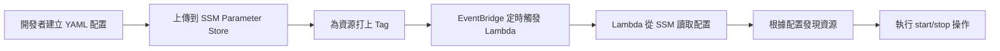

# Deployment Guide

本指南說明如何部署 Lights-Out Lambda 函數至 AWS，基於實際部署經驗整理。

## 前置條件

### 必要工具

- **Node.js:** 20.x (嚴格要求，使用 nvm 管理版本)
- **pnpm:** 最新版本 (`npm install -g pnpm`)
- **AWS CLI:** 已設定且能成功執行 `aws sts get-caller-identity`
- **Serverless Framework:** v3.39.0+ (透過 pnpm 自動安裝)
- **jq:** JSON 處理工具 (用於驗證)

### AWS 權限

部署此專案需要以下權限（建議使用 AdministratorAccess 進行首次部署）：

- Lambda 建立與管理
- IAM Role 建立
- SSM Parameter 存取
- CloudFormation Stack 建立與更新
- EventBridge Rule 建立
- S3 Bucket 建立（用於部署 artifacts）
- CloudWatch Logs 建立

---

## 重要決策記錄

### Serverless Framework 版本選擇

**使用 v3.39.0（非 v4）原因:**

- Serverless Framework v4 對年營收 >$2M 組織要求付費訂閱
- 本專案為 PoC 性質，使用免費的 v3 版本
- v3 與 v4 功能差異對本專案無影響

**相容性配置:**

- `serverless@3.39.0` + `serverless-esbuild@1.57.0`
- Node.js 20.x runtime (Lambda 與本地環境一致)
- `provider.runtime` 必須在 `serverless.yml` provider 層級明確定義

### SSM Parameter 創建方式

**採用手動創建（非 CloudFormation）原因:**

- CloudFormation Early Validation 對 SSM Parameter Value 格式過於嚴格
- YAML 配置轉 JSON 字串時的換行符問題難以在 CloudFormation 中處理
- 手動創建提供更好的靈活性和可維護性

---

## 完整部署流程

### Step 1: 環境準備

```bash
# 1. 切換到 Node.js 20.x
nvm install 20
nvm use 20
node -v  # 確認為 v20.x.x

# 2. Clone 專案並安裝依賴
cd aws-lights-out-plan
pnpm install

# 3. 型別檢查
pnpm run type:check
```

### Step 2: 配置檔案準備

本專案使用 **stage-based 配置管理**，配置檔案位於 `config/` 目錄。

#### 配置檔案結構（推薦）

```ini
config/
├── sss-lab.yml       # 唯一配置來源（YAML 格式，human-readable）
├── sss-dev.yml       # 其他環境配置
└── README.md         # 配置說明文件
```

**不需要** `.json` 或 `.json.txt` 中間檔案（手動創建 SSM Parameter 時會即時轉換）。

#### 創建新環境配置

```bash
# 1. 複製範例配置
cp config/sss-lab.yml config/your-stage.yml

# 2. 編輯配置
vim config/your-stage.yml

# 3. 驗證 YAML 格式
yamllint config/your-stage.yml
```

#### 配置檔案範例

參考 [config/sss-lab.yml](../config/sss-lab.yml) 的完整範例。

**關鍵配置說明:**

```yaml
version: '1.0'
environment: sss-lab # 環境識別符（對應 AWS 帳號別名）

regions: # 資源掃描的 AWS Regions（支援多 Region）
  - ap-southeast-1
  - ap-northeast-1

discovery:
  method: tags
  tags: # 資源必須有這些標籤才會被管理
    lights-out:managed: 'true'
    lights-out:env: sss-lab
  resource_types:
    - ecs:service # 支援的資源類型
    - rds:db

schedules:
  default:
    timezone: Asia/Taipei # 時區設定
    startTime: '09:00' # 每天啟動時間
    stopTime: '19:00' # 每天關閉時間
    activeDays: # 工作日
      - MON
      - TUE
      - WED
      - THU
      - FRI
    holidays: [] # 國定假日清單（YYYY-MM-DD）
```

### Step 3: AWS Credentials 設定

**⚠️ 重要：** 這是本專案最常見的問題來源。Serverless Framework 無法直接讀取 AWS SSO session，需要特別處理。

#### 快速檢查清單

在部署前，確保以下命令都能成功執行：

```bash
# 1. 驗證 AWS CLI 已登入
aws sts get-caller-identity --profile sss-lab

# 2. 驗證 profile 設定正確
aws configure list --profile sss-lab

# 3. 測試 SSO credentials
aws s3 ls --profile sss-lab  # 應該不報錯
```

如果以上任一步驟失敗，請依照下方排解步驟操作。

---

#### 方法 A: 手動導出環境變數（最可靠，推薦）

這是**經過實戰驗證最可靠的方法**，可以完全繞過 Serverless Framework 的 SSO 問題。

```bash
# 1. 確保已登入 SSO
aws sso login --profile sss-lab

# 2. 驗證登入狀態
aws sts get-caller-identity --profile sss-lab

# 3. 導出 credentials 為環境變數
eval $(aws configure export-credentials --profile sss-lab --format env)

# 4. 驗證環境變數已設定
echo "Access Key: $AWS_ACCESS_KEY_ID"
echo "Secret Key: ${AWS_SECRET_ACCESS_KEY:0:10}..."
echo "Session Token: ${AWS_SESSION_TOKEN:0:20}..."

# 5. 立即部署（憑證通常有效 1-12 小時）
npm run deploy
```

**優點：**

- ✅ 100% 可靠，不依賴 Serverless Framework 的 SSO 支援
- ✅ 適用於所有部署方式（互動式 CLI 或直接執行 serverless 命令）
- ✅ 容易除錯（可以直接檢查環境變數）

**注意事項：**

- ⚠️ 需要在每次新的 terminal session 重新執行
- ⚠️ credentials 有時效性（通常 1-12 小時，視組織 SSO 設定而定）
- ⚠️ credentials 過期後需要重新執行步驟 1-4

---

#### 方法 B: 配置 SSO Profile + 環境變數（推薦用於日常開發）

本專案的互動式 CLI 已支援自動設定 AWS_PROFILE，但仍可能遇到問題。

```bash
# 1. 配置 SSO Profile（一次性設定）
aws configure sso

# 互動式提示範例：
# SSO session name: viewsonic
# SSO start URL: [從 IT 管理員取得]
# SSO region: ap-southeast-1
# Account: 091947912308
# Role: AWSAdministratorAccess
# CLI default region: ap-southeast-1
# CLI profile name: sss-lab

# 2. 登入 SSO
aws sso login --profile sss-lab

# 3. 驗證 credentials
aws sts get-caller-identity --profile sss-lab

# 4. 設定環境變數
export AWS_PROFILE=sss-lab

# 5. 部署
npm run deploy
```

**如果仍然失敗，改用方法 A（手動導出環境變數）。**

---

#### 方法 C: 從 AWS Console 取得臨時憑證（緊急備案）

適用於無法使用 AWS CLI 的情況（例如：SSO 設定問題）。

1. 登入 AWS Console

2. 搜尋並開啟 **CloudShell**

3. 在 CloudShell 執行：

```bash
aws configure export-credentials --format env
```

4. 複製輸出到本地終端執行（包括 `export` 命令）

5. 在本地執行部署：

```bash
npm run deploy
```

---

#### 常見錯誤與解決方案

##### 錯誤 1: "The security token included in the request is invalid"

**原因：** Serverless Framework 無法正確讀取 SSO credentials。

**解決方案：**

```bash
# 完全清除 AWS cache
rm -rf ~/.aws/sso/cache/*
rm -rf ~/.aws/cli/cache/*

# 重新登入
aws sso logout
aws sso login --profile sss-lab

# 使用方法 A（手動導出環境變數）
eval $(aws configure export-credentials --profile sss-lab --format env)

# 重新部署
npm run deploy
```

##### 錯誤 2: "Credentials were refreshed, but the refreshed credentials are still expired"

**原因：** AWS SSO session cache 損壞或過期。

**解決方案：**

```bash
# 1. 完全清除所有 AWS credentials cache
rm -rf ~/.aws/login/
rm -rf ~/.aws/sso/cache/
rm -rf ~/.aws/cli/cache/
rm -rf .serverless/  # 清除 Serverless Framework cache

# 2. 重新登入
aws sso login --profile sss-lab

# 3. 使用方法 A（手動導出環境變數）
eval $(aws configure export-credentials --profile sss-lab --format env)

# 4. 驗證
echo "Access Key: $AWS_ACCESS_KEY_ID"

# 5. 重新部署
npm run deploy
```

##### 錯誤 3: "AWS provider credentials not found"

**原因：** Serverless Framework 找不到 credentials。

**解決方案：**

```bash
# 檢查是否已設定環境變數
env | grep AWS

# 如果沒有，使用方法 A
eval $(aws configure export-credentials --profile sss-lab --format env)

# 再次檢查
env | grep AWS

# 應該看到：
# AWS_ACCESS_KEY_ID=...
# AWS_SECRET_ACCESS_KEY=...
# AWS_SESSION_TOKEN=...
```

---

#### 專案配置說明

本專案已在以下檔案中配置 AWS profile 支援：

1. **`scripts/arguments/sss-lab.json`**：添加了 `"profile": "sss-lab"` 欄位
2. **`scripts/run-interactive.js`**：自動設定 `AWS_PROFILE` 環境變數並傳遞 `--aws-profile` 參數

但由於 `serverless-better-credentials` plugin 在某些環境下仍有問題，**強烈建議使用方法 A（手動導出環境變數）**作為主要部署方式。

### Step 4: 部署前驗證

```bash
# 1. 測試打包（不部署）
npx serverless package --stage sss-lab

# 2. 檢查生成的 CloudFormation template
cat .serverless/cloudformation-template-update-stack.json | jq '.Resources | keys'

# 3. 驗證函數配置
cat .serverless/cloudformation-template-update-stack.json | \
  jq '.Resources | to_entries[] | select(.key | contains("Lambda")) | {key:.key, runtime:.value.Properties.Runtime}'
```

### Step 5: 使用互動式 CLI 部署

本專案提供互動式部署工具，簡化部署流程。

#### 方式 1：完整部署（推薦首次部署）

```bash
# 啟動互動式部署選單
npm run deploy

# 互動流程：
# 1. 選擇目標環境（airsync-dev 或 sss-lab）
# 2. 選擇 "All - Full Serverless deployment"
# 3. 系統自動執行：
#    - 生成 EventBridge cron 表達式
#    - 執行 serverless deploy --verbose

# 預期輸出：
# ✔ Service deployed to stack lights-out-{stage} (117s)
# functions:
#   handler: lights-out-{stage} (1.3 MB)
```

#### 方式 2：僅更新 Lambda 程式碼（快速更新）

```bash
# 啟動互動式部署選單
npm run deploy

# 互動流程：
# 1. 選擇目標環境
# 2. 選擇 "Lambda Only - Quick Lambda function code update"
# 3. 系統自動執行 serverless deploy function -f handler
```

**部署完成後檢查項目:**

```bash
# 檢查 Lambda 函數
aws lambda get-function \
  --function-name lights-out-{stage} \
  --region {region}

# 檢查 CloudFormation Stack
aws cloudformation describe-stacks \
  --stack-name lights-out-{stage} \
  --region {region}
```

### Step 6: 部署 SSM Parameter Store 配置

部署成功後，使用互動式工具上傳配置到 SSM Parameter Store。

#### 使用互動式 CLI（推薦）

```bash
# 啟動配置管理選單
npm run config

# 互動流程：
# 1. 選擇目標環境（airsync-dev 或 sss-lab）
# 2. 選擇 "Upload - Deploy YAML config to SSM Parameter Store"
# 3. 系統自動從對應的 YAML 檔案讀取並上傳

# 預期輸出：
# ✅ SSM Parameter updated: /lights-out/{stage}/config
# Version: 2
```

#### 手動指令（進階使用）

```bash
# 僅在需要手動控制時使用
aws ssm put-parameter \
  --name "/lights-out/{stage}/config" \
  --type "String" \
  --value "$(node -e "const yaml = require('js-yaml'); const fs = require('fs'); console.log(JSON.stringify(yaml.load(fs.readFileSync('config/{stage}.yml', 'utf8'))));")" \
  --description "Lights Out configuration for {stage}" \
  --region {region} \
  --overwrite
```

#### 驗證 SSM Parameter

```bash
# 使用互動式 CLI 下載並查看當前配置
npm run config
# 選擇環境 → 選擇 "Retrieve - Fetch current config from SSM"

# 或使用 AWS CLI 手動查看
aws ssm get-parameter \
  --name "/lights-out/{stage}/config" \
  --region {region} \
  --query 'Parameter.{Name:Name,Type:Type,Version:Version,LastModified:LastModifiedDate}'

# 查看 Parameter 內容（格式化）
aws ssm get-parameter \
  --name "/lights-out/{stage}/config" \
  --region {region} \
  --query 'Parameter.Value' \
  --output text | jq .
```

### Step 7: 部署後驗證

#### 7.1 檢查 CloudFormation Stack

```bash
aws cloudformation describe-stacks \
  --stack-name lights-out-sss-lab \
  --region ap-southeast-1 \
  --query 'Stacks[0].{Status:StackStatus,Created:CreationTime,Updated:LastUpdatedTime}'
```

#### 7.2 檢查 Lambda 函數

```bash
aws lambda get-function \
  --function-name lights-out-sss-lab-handler \
  --region ap-southeast-1 \
  --query 'Configuration.{Name:FunctionName,Runtime:Runtime,Size:CodeSize,Timeout:Timeout,Memory:MemorySize,LastModified:LastModified}'
```

#### 7.3 檢查 EventBridge Rules

```bash
aws events list-rules \
  --name-prefix lights-out-sss-lab \
  --region ap-southeast-1 \
  --query 'Rules[].{Name:Name,State:State,Schedule:ScheduleExpression}' \
  --output table
```

#### 7.4 測試 Lambda 函數

**使用互動式 CLI（推薦）:**

```bash
# 啟動 Lambda 操作選單
npm run action

# 互動流程：
# 1. 選擇目標環境（airsync-dev 或 sss-lab）
# 2. 選擇操作：
#    - Discover: 發現帶有 lights-out tags 的資源
#    - Status: 檢查當前資源狀態
#    - Start: 啟動所有管理的資源
#    - Stop: 停止所有管理的資源

# 預期輸出範例（Discover）：
# {
#   "action": "discover",
#   "discovered_count": 2,
#   "resources": [...]
# }
```

**使用 AWS CLI（進階）:**

```bash
# 手動呼叫 Lambda（需要 AWS CLI v2）
aws lambda invoke \
  --function-name lights-out-{stage} \
  --cli-binary-format raw-in-base64-out \
  --payload '{"action":"discover"}' \
  --region {region} \
  out.json && cat out.json | jq .

# 或使用 file:// 協定
echo '{"action":"status"}' > payload.json
aws lambda invoke \
  --function-name lights-out-{stage} \
  --payload file://payload.json \
  --region {region} \
  out.json
```

**注意:**

- ✅ 使用互動式 CLI 會自動處理所有參數
- ✅ `discovered_count: 0` 是正常的（尚未標記任何資源）
- ❌ AWS CLI v1 需要 base64 編碼 payload

#### 7.5 查看 Lambda 日誌

```bash
# 即時查看日誌
aws logs tail /aws/lambda/lights-out-sss-lab-handler \
  --follow \
  --region ap-southeast-1 \
  --format short

# 查看最近 10 分鐘的日誌
aws logs tail /aws/lambda/lights-out-sss-lab-handler \
  --region ap-southeast-1 \
  --since 10m \
  --format short
```

---

## 部署的 AWS 資源

Serverless Framework 會自動建立以下資源：

### Lambda Function

- **Name:** `lights-out-{stage}-lights-out`
- **Runtime:** Node.js 20.x
- **Memory:** 512 MB
- **Timeout:** 300 seconds (5 分鐘)
- **Handler:** `src/index.main`
- **Package Size:** ~1.3 MB (esbuild 打包後)

### IAM Role

自動生成，包含以下權限：

```yaml
iam:
  role:
    statements:
      - Effect: Allow
        Action: [ssm:GetParameter]
        Resource: arn:aws:ssm:${AWS::Region}:${AWS::AccountId}:parameter/lights-out/*
      - Effect: Allow
        Action: [tag:GetResources]
        Resource: '*'
      - Effect: Allow
        Action:
          - ecs:DescribeServices
          - ecs:UpdateService
          - ecs:ListServices
          - ecs:DescribeClusters
        Resource: '*'
      - Effect: Allow
        Action:
          - application-autoscaling:DescribeScalableTargets
          - application-autoscaling:RegisterScalableTarget
        Resource: '*'
      - Effect: Allow
        Action:
          - rds:DescribeDBInstances
          - rds:StartDBInstance
          - rds:StopDBInstance
        Resource: '*'
      - Effect: Allow
        Action:
          - logs:CreateLogGroup
          - logs:CreateLogStream
          - logs:PutLogEvents
        Resource: '*'
```

### SSM Parameter (手動創建)

- **Name:** `/lights-out/config`
- **Type:** String
- **Value:** JSON 字串（從 `config/{stage}.yml` 轉換）
- **Tier:** Standard (免費)

### EventBridge Rules

**Start Rule:** `lights-out-{stage}-start`

- **Schedule:** `cron(0 1 ? * MON-FRI *)` (每週一至五 09:00 台北時間 / 01:00 UTC)
- **Input:** `{"action":"start"}`
- **Status:** ENABLED

**Stop Rule:** `lights-out-{stage}-stop`

- **Schedule:** `cron(0 11 ? * MON-FRI *)` (每週一至五 19:00 台北時間 / 11:00 UTC)
- **Input:** `{"action":"stop"}`
- **Status:** ENABLED

### CloudWatch Log Group

- **Name:** `/aws/lambda/lights-out-{stage}-lights-out`
- **Retention:** 無限期 (可手動設定)

### S3 Deployment Bucket

- **Name:** `lights-out-{stage}-serverlessdeploymentbucket-{hash}`
- **Purpose:** 儲存 Lambda 部署 artifacts 和 CloudFormation templates
- **Encryption:** AES256

---

## 部署問題排解

### 1. Runtime Not Supported Error

**錯誤訊息:**

```yaml
AssertionError [ERR_ASSERTION]: not a supported runtime
```

**原因:** `serverless.yml` 缺少 `provider.runtime` 設定。

**解決方法:**

確保 `serverless.yml` 包含：

```yaml
provider:
  name: aws
  region: ap-southeast-1
  runtime: nodejs20.x # 必須在 provider 層級定義
```

**驗證:**

```bash
grep "runtime:" serverless.yml
```

---

### 2. AWS Credentials Not Found

**錯誤訊息:**

```ini
AWS provider credentials not found.
```

**原因:** Serverless Framework 無法讀取 AWS CLI login session。

**解決方法:**

```bash
# 選項 1: 匯出環境變數（快速）
eval $(aws configure export-credentials --format env)

# 驗證
aws sts get-caller-identity

# 選項 2: 使用 SSO Profile（長期）
export AWS_PROFILE=sss-lab
aws sso login --profile sss-lab
```

**常見變體:**

- `Credentials were refreshed, but the refreshed credentials are still expired.`

- **解決:** 完全清除 cache 並重新登入

```bash
rm -rf ~/.aws/login/ ~/.aws/cli/cache/
aws login
eval $(aws configure export-credentials --format env)
```

---

### 3. CloudFormation Early Validation Error

**錯誤訊息:**

```ini
The following hook(s)/validation failed: [AWS::EarlyValidation::PropertyValidation]
```

**原因:** CloudFormation 對 SSM Parameter Value 格式過於嚴格，特別是 YAML object 轉 JSON 時的問題。

**解決方法:**

從 `serverless.yml` 移除 SSM Parameter 資源，改為手動創建：

```yaml
# serverless.yml
resources: {} # 移除 LightsOutConfigParameter
```

手動創建：

```bash
pnpm run config:update
```

**驗證:**

```bash
aws ssm get-parameter --name "/lights-out/config" --region ap-southeast-1
```

---

### 4. SSM Parameter Tags 和 Overwrite 衝突

**錯誤訊息:**

```yaml
ValidationException: tags and overwrite can't be used together
```

**解決方法:**

分兩步執行：

```bash
# 步驟 1: 創建/更新 Parameter（不帶 tags）
aws ssm put-parameter \
  --name "/lights-out/config" \
  --type "String" \
  --value "$(cat config/sss-lab.json.txt)" \
  --description "Lights Out configuration" \
  --region ap-southeast-1 \
  --overwrite

# 步驟 2: 加入 Tags（可選）
aws ssm add-tags-to-resource \
  --resource-type "Parameter" \
  --resource-id "/lights-out/config" \
  --tags "Key=project,Value=lights-out" \
  --region ap-southeast-1
```

---

### 5. EventBridge Rule Already Exists

**錯誤訊息:**

```sh
CREATE_FAILED: Resource of type 'AWS::Events::Rule' with identifier 'lights-out-sss-lab-stop' already exists.
```

**原因:** 改變函數名稱後，CloudFormation 嘗試重新創建 EventBridge Rules，但舊的 Rules 仍存在。

**解決方法:**

#### 選項 A: 刪除舊的 Rules

```bash
# 刪除舊的 EventBridge Rules
aws events remove-targets --rule lights-out-sss-lab-start --ids "1" --region ap-southeast-1
aws events delete-rule --name lights-out-sss-lab-start --region ap-southeast-1

aws events remove-targets --rule lights-out-sss-lab-stop --ids "1" --region ap-southeast-1
aws events delete-rule --name lights-out-sss-lab-stop --region ap-southeast-1

# 重新部署
npx serverless deploy --stage sss-lab
```

#### 選項 B: 完全重建 Stack

```bash
# 1. 等待 rollback 完成（如果正在 rollback）
aws cloudformation describe-stacks \
  --stack-name lights-out-sss-lab \
  --region ap-southeast-1 \
  --query 'Stacks[0].StackStatus'

# 2. 移除 Stack
npx serverless remove --stage sss-lab

# 3. 重新部署
npx serverless deploy --stage sss-lab

# 4. 重新創建 SSM Parameter
pnpm run config:update
```

---

### 6. Stack Rollback 無法刪除

**錯誤訊息:**

```sh
Stack cannot be deleted while in status UPDATE_ROLLBACK_COMPLETE_CLEANUP_IN_PROGRESS
```

**原因:** CloudFormation 正在執行 rollback cleanup，必須等待完成。

**解決方法:**

```bash
# 持續監控 Stack 狀態（每 5 秒刷新）
watch -n 5 'aws cloudformation describe-stacks \
  --stack-name lights-out-sss-lab \
  --region ap-southeast-1 \
  --query "Stacks[0].StackStatus" \
  --output text'

# 等待狀態變為 UPDATE_ROLLBACK_COMPLETE（通常 1-2 分鐘）

# 然後執行刪除
npx serverless remove --stage sss-lab
```

---

### 7. Lambda Invoke Payload 格式錯誤

**錯誤訊息:**

```sh
Invalid base64: "{"action":"discover"}"
```

**原因:** `--payload` 參數需要 base64 編碼或使用 `file://` 協定。

**解決方法:**

```bash
# 方法 1: 使用 file://（推薦）
echo '{"action":"discover"}' > payload.json
aws lambda invoke \
  --function-name lights-out-sss-lab-handler \
  --payload file://payload.json \
  --region ap-southeast-1 \
  out.json

# 方法 2: 使用 CLI v2 的 JSON 格式
aws lambda invoke \
  --function-name lights-out-sss-lab-handler \
  --cli-binary-format raw-in-base64-out \
  --payload '{"action":"discover"}' \
  --region ap-southeast-1 \
  out.json
```

---

### 8. Node Version Mismatch

**警告訊息:**

```yaml
WARN Unsupported engine: wanted: {"node":">=20.0.0 <21.0.0"} (current: {"node":"v22.12.0"})
```

**影響:** TypeScript 編譯可能成功，但 serverless-esbuild 可能有相容性問題。

**解決方法:**

```bash
# 切換到 Node 20.x
nvm use 20

# 驗證版本
node -v  # 應顯示 v20.x.x

# 清理並重新安裝
rm -rf node_modules pnpm-lock.yaml
pnpm install
```

---

### 9. CloudFormation Intrinsic Function 語法錯誤

**錯誤訊息:**

```yaml
yamllint: unknown tag !<!Sub>
```

**原因:** YAML tag 語法不相容。

**解決方法:**

使用標準 YAML map 語法：

```yaml
# ❌ 錯誤
Resource: !Sub "arn:aws:ssm:${AWS::Region}:..."

# ✅ 正確
Resource:
  Fn::Sub: "arn:aws:ssm:${AWS::Region}:${AWS::AccountId}:parameter/lights-out/*"
```

---

### 10. Discovered Count 為 0

**現象:**

```json
{
  "statusCode": 200,
  "body": "{\"discovered_count\":0,\"resources\":[]}"
}
```

**原因:** 沒有資源被標記為 `lights-out:managed: true`。

**解決方法:**

參考上方 "Step 4: 標記 AWS 資源" 章節，為資源加上必要的 tags。

**常見原因排查:**

1. **標籤拼寫錯誤** — `lights-out:managed` 不是 `lightsout:managed`
2. **env/project 標籤不匹配** — 配置檔案中的 `discovery.tags` 必須與實際資源 tag 一致
3. **資源類型未設定** — 配置檔案的 `discovery.resource_types` 要包含該資源類型
4. **IAM 權限不足** — Lambda 需要 `tag:GetResources` 權限
5. **Region 不匹配** — 確認配置檔案的 `regions` 包含資源所在 region

**驗證:**

```bash
# 使用互動式 CLI 重新 discover
npm run action
# 選擇環境 → 選擇 "Discover"

# 查看詳細日誌
aws logs tail /aws/lambda/lights-out-{stage} \
  --region {region} \
  --since 5m \
  --format short
```

---

## 更新與維護

### 更新 Lambda 程式碼

```bash
# 1. 修改程式碼
vim src/index.ts

# 2. 型別檢查
npm run type:check

# 3. 使用互動式 CLI 部署
npm run deploy
# 選擇環境 → 選擇 "Lambda Only - Quick update" (約 10 秒)
# 或選擇 "All - Full deployment" (約 2 分鐘，包含 infrastructure)
```

### 更新配置

```bash
# 1. 修改配置檔案
vim config/{stage}.yml
# 或 vim config/pg-development/airsync-dev.yml

# 2. 使用互動式 CLI 上傳配置
npm run config
# 選擇環境 → 選擇 "Upload - Deploy YAML config to SSM"

# 3. 驗證更新（可選）
npm run config
# 選擇環境 → 選擇 "Retrieve - Fetch current config"

# 4. 測試 Lambda（會自動讀取新配置）
npm run action
# 選擇環境 → 選擇 "Discover" 或 "Status"
```

**注意:** Lambda 會在每次執行時從 SSM Parameter 讀取最新配置，無需重新部署 Lambda。

### 更新 EventBridge 排程

排程配置來自各環境的 YAML 檔案，修改後需完整部署：

```bash
# 1. 修改配置檔案中的排程
vim config/{stage}.yml

# 2. 完整部署（會重新生成 cron 表達式並更新 EventBridge）
npm run deploy
# 選擇環境 → 選擇 "All - Full deployment"

# 3. 驗證新排程
aws events list-rules \
  --name-prefix lights-out-{stage} \
  --region {region} \
  --query 'Rules[].{Name:Name,Schedule:ScheduleExpression}'
```

---

## 移除部署

### 完整移除 Stack

```bash
# 刪除 CloudFormation Stack（包含所有資源）
npx serverless remove --stage sss-lab

# 驗證刪除
aws cloudformation describe-stacks \
  --stack-name lights-out-sss-lab \
  --region ap-southeast-1
# 應該返回 "Stack with id lights-out-sss-lab does not exist"
```

**注意:** `serverless remove` 會刪除：

- ✅ Lambda Function
- ✅ IAM Role
- ✅ EventBridge Rules
- ✅ CloudWatch Log Group
- ✅ S3 Deployment Bucket (如果為空)
- ❌ **SSM Parameter** (手動創建的需手動刪除)

### 手動清理 SSM Parameter

```bash
aws ssm delete-parameter \
  --name "/lights-out/config" \
  --region ap-southeast-1
```

### 保留日誌的移除方式

如果需要保留 CloudWatch Logs：

```bash
# 1. 匯出日誌到 S3
aws logs create-export-task \
  --log-group-name /aws/lambda/lights-out-sss-lab-handler \
  --from $(date -u -d '30 days ago' +%s)000 \
  --to $(date +%s)000 \
  --destination your-s3-bucket \
  --destination-prefix lights-out-logs

# 2. 移除 Stack
npx serverless remove --stage sss-lab
```

---

## 監控與告警

### CloudWatch Metrics

Lambda 預設提供的 Metrics:

- **Invocations:** 執行次數
- **Duration:** 執行時間
- **Errors:** 錯誤次數
- **Throttles:** 被限流次數

查看 Metrics:

```bash
# 最近 1 小時的執行次數
aws cloudwatch get-metric-statistics \
  --namespace AWS/Lambda \
  --metric-name Invocations \
  --dimensions Name=FunctionName,Value=lights-out-sss-lab-handler \
  --start-time $(date -u -d '1 hour ago' +%Y-%m-%dT%H:%M:%S) \
  --end-time $(date -u +%Y-%m-%dT%H:%M:%S) \
  --period 300 \
  --statistics Sum \
  --region ap-southeast-1

# 最近 1 小時的錯誤次數
aws cloudwatch get-metric-statistics \
  --namespace AWS/Lambda \
  --metric-name Errors \
  --dimensions Name=FunctionName,Value=lights-out-sss-lab-handler \
  --start-time $(date -u -d '1 hour ago' +%Y-%m-%dT%H:%M:%S) \
  --end-time $(date -u +%Y-%m-%dT%H:%M:%S) \
  --period 300 \
  --statistics Sum \
  --region ap-southeast-1
```

### 設定 CloudWatch Alarms

```bash
# Lambda 錯誤告警
aws cloudwatch put-metric-alarm \
  --alarm-name lights-out-sss-lab-errors \
  --alarm-description "Lights-Out Lambda errors" \
  --metric-name Errors \
  --namespace AWS/Lambda \
  --statistic Sum \
  --period 300 \
  --evaluation-periods 1 \
  --threshold 1 \
  --comparison-operator GreaterThanOrEqualToThreshold \
  --dimensions Name=FunctionName,Value=lights-out-sss-lab-handler \
  --alarm-actions arn:aws:sns:ap-southeast-1:ACCOUNT_ID:your-sns-topic \
  --region ap-southeast-1

# Lambda 執行時間告警（超過 4 分鐘）
aws cloudwatch put-metric-alarm \
  --alarm-name lights-out-sss-lab-duration \
  --alarm-description "Lights-Out Lambda duration warning" \
  --metric-name Duration \
  --namespace AWS/Lambda \
  --statistic Average \
  --period 300 \
  --evaluation-periods 1 \
  --threshold 240000 \
  --comparison-operator GreaterThanThreshold \
  --dimensions Name=FunctionName,Value=lights-out-sss-lab-handler \
  --alarm-actions arn:aws:sns:ap-southeast-1:ACCOUNT_ID:your-sns-topic \
  --region ap-southeast-1
```

---

## 新增專案到多專案模式

本專案支援在同一 AWS 帳號部署多個獨立的 Lambda 函數，每個專案有自己的配置和排程。

### 步驟 1: 建立配置檔案

```bash
# 建立新專案配置目錄（如果需要）
mkdir -p config/pg-development

# 複製範例配置
cp config/pg-development/airsync-dev.yml config/pg-development/new-service-dev.yml

# 編輯配置
vim config/pg-development/new-service-dev.yml
```

### 步驟 2: 建立 target 參數檔案

```bash
# 建立 scripts/arguments/new-service-dev.json
cat > scripts/arguments/new-service-dev.json <<'EOF'
{
  "scope": "project",
  "region": "us-east-1",
  "stage": "pg-development-new-service-dev",
  "function-name": "lights-out-pg-development-new-service-dev",
  "config": {
    "name": "/lights-out/pg-development-new-service-dev/config",
    "path": "config/pg-development/new-service-dev.yml",
    "description": "Lights Out configuration for new-service-dev project"
  }
}
EOF
```

**參數說明:**

- `scope`: `"project"` (專案 scope) 或 `"aws-account"` (帳號 scope)
- `region`: Lambda 部署的 AWS region
- `stage`: Serverless Framework stage 名稱
- `function-name`: Lambda 函數名稱
- `config.name`: SSM Parameter Store 路徑
- `config.path`: 本地 YAML 配置檔案路徑

### 步驟 3: 更新 serverless.yml

在 `custom.resolveConfigPath` 中新增映射：

```yaml
custom:
  resolveConfigPath:
    pg-development-airsync-dev: pg-development/airsync-dev.yml
    pg-development-new-service-dev: pg-development/new-service-dev.yml # 新增
```

### 步驟 4: 標記 AWS 資源

所有需要管理的資源**必須**具備以下標籤。詳細說明請參考本文 "部署前驗證 → Step 4: 標記 AWS 資源" 章節。

```bash
# 多專案模式標籤範例
aws ecs tag-resource \
  --resource-arn arn:aws:ecs:{region}:ACCOUNT:service/CLUSTER/SERVICE \
  --tags \
    Key=lights-out:managed,Value=true \
    Key=lights-out:project,Value=new-service-dev \
    Key=lights-out:priority,Value=50 \
  --region {region}
```

### 步驟 5: 使用互動式 CLI 部署

```bash
# 部署 Lambda
npm run deploy
# 選擇 "new-service-dev ({region})" → 選擇 "All"

# 上傳配置到 SSM
npm run config
# 選擇 "new-service-dev ({region})" → 選擇 "Upload"

# 驗證部署
npm run action
# 選擇 "new-service-dev ({region})" → 選擇 "Discover"
```

---

## ECS Service 配置指南

### 配置結構

ECS Service 使用統一的 `start` 和 `stop` 配置，支援兩種模式：

#### 1. Auto Scaling Mode（有 Application Auto Scaling）

當 ECS Service 配置了 Application Auto Scaling 時，使用此模式。

```yaml
resource_defaults:
  ecs-service:
    waitForStable: true
    stableTimeoutSeconds: 300
    start:
      minCapacity: 2
      maxCapacity: 6
      desiredCount: 2
    stop:
      minCapacity: 0
      maxCapacity: 0
      desiredCount: 0
```

**說明:**

- `minCapacity`: Auto Scaling 最小容量
- `maxCapacity`: Auto Scaling 最大容量
- `desiredCount`: 期望任務數量（必須在 min 和 max 之間）
- START 操作：設定 Auto Scaling 範圍並啟動服務
- STOP 操作：將 Auto Scaling 範圍設為 0 以完全關閉

#### 2. Direct Mode（無 Application Auto Scaling）

當 ECS Service 沒有配置 Application Auto Scaling 時，使用此模式。

```yaml
resource_defaults:
  ecs-service:
    waitForStable: true
    stableTimeoutSeconds: 300
    start:
      desiredCount: 1
    stop:
      desiredCount: 0
```

**說明:**

- 僅需指定 `desiredCount`
- START 操作：設定服務的任務數量
- STOP 操作：將任務數量設為 0

### 檢查 Service 是否有 Auto Scaling

```bash
# 檢查 Service 是否有 Application Auto Scaling
aws application-autoscaling describe-scalable-targets \
  --service-namespace ecs \
  --resource-ids service/{cluster-name}/{service-name} \
  --scalable-dimension ecs:service:DesiredCount \
  --region {region}
```

如果回傳結果有 `ScalableTargets`，表示 Service 有 Auto Scaling，應使用 Auto Scaling Mode 配置。

### 配置步驟

**步驟 1: 確認現有設定**

```bash
# 如果有 Auto Scaling，取得當前範圍
aws application-autoscaling describe-scalable-targets \
  --service-namespace ecs \
  --resource-ids service/{cluster}/{service} \
  --scalable-dimension ecs:service:DesiredCount \
  --region {region} \
  --query 'ScalableTargets[0].{Min:MinCapacity,Max:MaxCapacity}'

# 如果沒有 Auto Scaling，取得當前任務數
aws ecs describe-services \
  --cluster {cluster} \
  --services {service} \
  --region {region} \
  --query 'services[0].desiredCount'
```

**步驟 2: 更新配置檔案**

根據上述檢查結果，選擇對應的配置模式（Auto Scaling Mode 或 Direct Mode）。

**步驟 3: 上傳配置**

```bash
# 使用互動式 CLI 上傳配置
npm run config
# 選擇對應環境 → 選擇 "Upload"
```

**步驟 4: 驗證**

```bash
# 測試 START 操作
npm run action
# 選擇環境 → 選擇 "Start"

# 檢查 CloudWatch Logs
aws logs tail /aws/lambda/lights-out-{stage} \
  --region {region} \
  --since 5m

# 應顯示操作成功的日誌
```

### 混合環境配置

如果同一環境中有些 Service 有 Auto Scaling，有些沒有：

```yaml
resource_defaults:
  ecs-service:
    waitForStable: true
    stableTimeoutSeconds: 300
    # 對於有 Auto Scaling 的 Service
    start:
      minCapacity: 2
      maxCapacity: 6
      desiredCount: 2
    stop:
      minCapacity: 0
      maxCapacity: 0
      desiredCount: 0
```

Lambda 會在執行時動態偵測每個 Service 是否有 Auto Scaling，並使用對應的 API：

- **有 Auto Scaling**: 使用 `RegisterScalableTarget` 設定 min/max capacity
- **無 Auto Scaling**: 僅使用 `UpdateService` 設定 desiredCount

---

## 多 Region 部署

### 部署至多個 Region

```bash
# 部署至 ap-southeast-1（主要 Region）
npx serverless deploy --stage sss-lab --region ap-southeast-1

# 部署至 ap-northeast-1（次要 Region）
npx serverless deploy --stage sss-lab --region ap-northeast-1

# 分別創建 SSM Parameters
aws ssm put-parameter \
  --name "/lights-out/config" \
  --type "String" \
  --value "$(node -e "const yaml = require('js-yaml'); const fs = require('fs'); console.log(JSON.stringify(yaml.load(fs.readFileSync('config/sss-lab.yml', 'utf8'))));")" \
  --description "Lights Out configuration for sss-lab" \
  --region ap-southeast-1 \
  --overwrite

aws ssm put-parameter \
  --name "/lights-out/config" \
  --type "String" \
  --value "$(node -e "const yaml = require('js-yaml'); const fs = require('fs'); console.log(JSON.stringify(yaml.load(fs.readFileSync('config/sss-lab.yml', 'utf8'))));")" \
  --description "Lights Out configuration for sss-lab" \
  --region ap-northeast-1 \
  --overwrite
```

**注意:**

- 每個 Region 會建立獨立的 CloudFormation Stack
- SSM Parameter 需要在每個 Region 單獨創建
- EventBridge Rules 獨立於各 Region
- Lambda 會掃描配置檔案中指定的所有 `regions`（跨 Region 掃描）

### 配置跨 Region 掃描

在 `config/sss-lab.yml` 中指定要掃描的 Regions：

```yaml
regions:
  - ap-southeast-1 # Singapore
  - ap-northeast-1 # Tokyo
  - us-west-2 # Oregon
```

單一 Lambda 部署在一個 Region，但會掃描所有指定的 Regions。

---

## 成本估算

### Lambda 費用

- **Free Tier:** 每月 100 萬次請求 + 400,000 GB-秒運算時間
- **本專案估算:**
  - 每天 2 次執行 (start/stop)
  - 每次執行約 30 秒
  - 512 MB memory
  - **每月請求:** ~60 次
  - **每月 GB-秒:** 60 × 30 × 0.5 = 900 GB-秒
  - **月費用:** $0 (完全在 Free Tier 內)

### 其他資源費用

- **SSM Parameter (Standard):** 免費
- **EventBridge Rules:** 免費 (前 100 萬次事件)
- **CloudWatch Logs:** 前 5GB 免費，之後 $0.50/GB
- **S3 (Deployment Bucket):** 幾乎可忽略（< $0.01/月）

**總計:** 對於 PoC 環境，預估月費用 < $1

---

## 常見使用場景

### 場景 1: 測試資源管理

```bash
# 1. 為測試 ECS Service 加標籤
aws ecs tag-resource \
  --resource-arn arn:aws:ecs:ap-southeast-1:ACCOUNT_ID:service/test-cluster/test-service \
  --tags key=lights-out:managed,value=true \
        key=lights-out:env,value=sss-lab \
  --region ap-southeast-1

# 2. 發現資源
aws lambda invoke \
  --function-name lights-out-sss-lab-handler \
  --payload file://payload-discover.json \
  --region ap-southeast-1 \
  out.json && cat out.json | jq '.body | fromjson'

# 3. 查看資源狀態
aws lambda invoke \
  --function-name lights-out-sss-lab-handler \
  --payload file://payload-status.json \
  --region ap-southeast-1 \
  out.json && cat out.json | jq '.body | fromjson'

# 4. 測試停止（Dry Run）
aws lambda invoke \
  --function-name lights-out-sss-lab-handler \
  --payload file://payload-stop-dry.json \
  --region ap-southeast-1 \
  out.json && cat out.json | jq '.body | fromjson'

# 5. 實際停止
echo '{"action":"stop"}' > payload-stop.json
aws lambda invoke \
  --function-name lights-out-sss-lab-handler \
  --payload file://payload-stop.json \
  --region ap-southeast-1 \
  out.json && cat out.json | jq '.body | fromjson'
```

### 場景 2: 更新排程時間

```bash
# 1. 修改 serverless.yml
# 將 start 時間從 09:00 改為 08:00 TPE
vim serverless.yml
# 修改 cron(0 1 ? * MON-FRI *) 為 cron(0 0 ? * MON-FRI *)

# 2. 重新部署
npx serverless deploy --stage sss-lab

# 3. 驗證新排程
aws events list-rules \
  --name-prefix lights-out-sss-lab \
  --region ap-southeast-1 \
  --query 'Rules[].{Name:Name,Schedule:ScheduleExpression}'
```

### 場景 3: 臨時停用自動排程

```bash
# 停用 EventBridge Rules
aws events disable-rule --name lights-out-sss-lab-start --region ap-southeast-1
aws events disable-rule --name lights-out-sss-lab-stop --region ap-southeast-1

# 驗證狀態
aws events list-rules \
  --name-prefix lights-out-sss-lab \
  --region ap-southeast-1 \
  --query 'Rules[].{Name:Name,State:State}'

# 重新啟用
aws events enable-rule --name lights-out-sss-lab-start --region ap-southeast-1
aws events enable-rule --name lights-out-sss-lab-stop --region ap-southeast-1
```

---

## SSM Parameter Store 操作

### 配置工作流程



**關鍵點：**

- 配置改變無需重新部署 Lambda（熱更新）
- Lambda 啟動時才讀取 SSM，5 分鐘內用 cache
- 多環境共用同一個 Lambda，靠 SSM 參數區分

### 上傳配置到 SSM

```bash
# 使用互動式 CLI（推薦）
npm run config
# 選擇環境 → 選擇 "Upload - Deploy YAML config to SSM"

# 預期輸出：
# ✅ SSM Parameter updated: /lights-out/{stage}/config
# Version: 2
```

### 下載當前配置

```bash
# 使用互動式 CLI
npm run config
# 選擇環境 → 選擇 "Retrieve - Fetch current config from SSM"

# 或使用 AWS CLI
aws ssm get-parameter \
  --name "/lights-out/{stage}/config" \
  --region {region} \
  --query 'Parameter.Value' \
  --output text | jq .
```

### 查看配置版本歷史

```bash
# 列出所有版本
aws ssm get-parameter-history \
  --name "/lights-out/{stage}/config" \
  --region {region} \
  --query 'Parameters[*].{Version:Version,LastModified:LastModifiedDate,ModifiedBy:LastModifiedUser}' \
  --output table

# 回滾到特定版本
aws ssm get-parameter \
  --name "/lights-out/{stage}/config:{version}" \
  --region {region}
```

### 配置更新最佳實踐

1. **修改前先備份**

```bash
# 下載當前配置
npm run config
# 選擇 "Retrieve" → 複製輸出內容備份
```

2. **本地驗證 YAML 格式**

```bash
# 使用 Python 驗證
python3 -c "import yaml; yaml.safe_load(open('config/{stage}.yml'))"

# 或使用 yamllint
yamllint config/{stage}.yml
```

3. **上傳配置**

```bash
npm run config
# 選擇 "Upload"
```

4. **驗證配置生效**

```bash
# 測試 discover action
npm run action
# 選擇環境 → 選擇 "Discover"
```

---

## 相關文件

- [CLAUDE.md](../CLAUDE.md) - 專案架構與規範
- [config/sss-lab.yml](../config/sss-lab.yml) - sss-lab 配置範例（含詳細註解）
- [config/pg-development/airsync-dev.yml](../config/pg-development/airsync-dev.yml) - airsync-dev 配置範例
- [serverless.yml](../serverless.yml) - Infrastructure as Code

---

## ECS Application Auto Scaling 整合

### 功能概述

本專案支援 ECS Service 的 Application Auto Scaling 整合，採用**條件式偵測模式**：

- **有 Auto Scaling 的 Service**: 透過 `RegisterScalableTarget` 管理 MinCapacity/MaxCapacity
- **無 Auto Scaling 的 Service**: 直接設定 desiredCount

### 配置範例

**有 Auto Scaling 的環境（airsync-dev）:**

```yaml
resource_defaults:
  ecs-service:
    waitForStable: true
    stableTimeoutSeconds: 300
    start:
      minCapacity: 2
      maxCapacity: 6
      desiredCount: 2
    stop:
      minCapacity: 0
      maxCapacity: 0
      desiredCount: 0
```

**無 Auto Scaling 的環境（sss-lab）:**

```yaml
resource_defaults:
  ecs-service:
    waitForStable: true
    stableTimeoutSeconds: 300
    start:
      desiredCount: 1
    stop:
      desiredCount: 0
```

### 運作邏輯

**START 操作:**

1. 偵測 Service 是否有 Auto Scaling
2. 如果有：設定 MinCapacity、MaxCapacity 和 desiredCount
3. 如果無：設定 desiredCount

**STOP 操作:**

1. 偵測 Service 是否有 Auto Scaling
2. 如果有：設定 MinCapacity=0, MaxCapacity=0, desiredCount=0
3. 如果無：設定 desiredCount=0

### 驗證檢查清單

部署後驗證 Auto Scaling 整合：

```bash
# 1. 檢查 CloudWatch Logs 是否偵測到 Auto Scaling
aws logs tail /aws/lambda/lights-out-{stage}-handler \
  --region {region} \
  --since 10m \
  --filter-pattern "Auto Scaling"

# 2. 測試 START 操作
aws lambda invoke \
  --function-name lights-out-{stage}-handler \
  --payload '{"action":"start","dryRun":true}' \
  out.json && cat out.json | jq .

# 3. 驗證 AWS Console 的 ECS Service
# - 確認 desired count 正確
# - 確認 Auto Scaling MinCapacity/MaxCapacity 正確

# 4. 等待 10 分鐘，確認 Auto Scaling policy 不會與 Lambda 競爭
```

---

## 版本歷史

### v3.3 (2025-12-31)

- **重大變更:** 簡化 ECS Service 配置結構
- 統一使用 `start` 和 `stop` 配置取代 `autoScaling`、`defaultDesiredCount`、`stopBehavior`
- 更新 Zod schema 驗證以支援新結構
- 使用 TypeScript discriminated union types 強化型別檢查
- 更新部署指南文件

### v3.2 (2025-12-30)

- **新功能:** ECS Application Auto Scaling 整合（條件式偵測模式）
- 新增 IAM 權限：`application-autoscaling:DescribeScalableTargets`, `RegisterScalableTarget`
- 更新 config schema 驗證（Zod）
- 新增已知問題：Serverless Framework + AWS SSO Credentials

### v3.1 (2025-12-24)

- **重大變更:** SSM Parameter 改為手動創建（避免 CloudFormation Early Validation 問題）
- 新增 `pnpm run config:update` 指令
- 簡化配置檔案結構（僅保留 YAML 格式）
- 完善問題排解區塊（10+ 常見問題及解決方案）
- 新增實際測試流程和使用場景
- 更新 AWS Credentials 設定方法（基於實際可行方案）
- 修正 Lambda invoke payload 格式說明

### v3.0 (2025-12-24)

- 降級至 Serverless Framework v3.39.0（避免 v4 付費限制）
- 修復 SSM Parameter Value 型別問題（使用字串化 JSON）
- 修復 CloudFormation intrinsic function 語法（使用 `Fn::Sub`）
- 新增 AWS CLI login session credential 匯出流程
- 強制 Node.js 20.x runtime 要求
- 完善故障排除文件

### v2.0 (2025-12-24)

- TypeScript 實作，統一使用 Serverless Framework 部署
- 支援多 Region 資源掃描
- Tag-based 資源發現機制

### v1.0 (2025-12-17)

- Python 原型（已移除）
