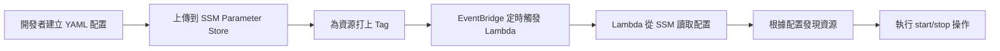

# SSM Parameter Store 操作指南

## 目錄
1. [工作流程總覽](#工作流程總覽)
2. [初始設定](#初始設定)
3. [日常操作](#日常操作)
4. [故障排除](#故障排除)

---

## 工作流程總覽



**關鍵點：**
- 配置改變無需重新部署 Lambda（熱更新）
- Lambda 啟動時才讀取 SSM，5 分鐘內用 cache
- 多環境共用同一個 Lambda，靠 SSM 參數區分

---

## 初始設定

### Step 1: 建立 SSM 參數

#### 方法 A：使用 AWS CLI（推薦，可版本控制）

```bash
# 建立 AirSync Dev 環境配置
aws ssm put-parameter \
  --name "/lights-out/dev/airsync" \
  --value file://docs/examples/ssm-config-airsync-dev.yaml \
  --type String \
  --description "AirSync 開發環境 lights-out 排程配置" \
  --tags "Key=Project,Value=AirSync" "Key=Environment,Value=dev" \
  --region ap-northeast-1

# 建立 VS Account Stage 環境配置
aws ssm put-parameter \
  --name "/lights-out/stage/vs-account" \
  --value file://docs/examples/ssm-config-vs-account-stage.yaml \
  --type String \
  --description "VS Account 預發布環境 lights-out 排程配置" \
  --tags "Key=Project,Value=VSAccount" "Key=Environment,Value=stage" \
  --region ap-northeast-1
```

**成本：** 標準參數（<4KB）免費

#### 方法 B：使用 AWS Console

1. 前往 **Systems Manager > Parameter Store**
2. 點擊 **Create parameter**
3. 填入：
   - Name: `/lights-out/dev/airsync`
   - Type: `String`
   - Value: 貼上 YAML 內容
4. 點擊 **Create parameter**

---

### Step 2: 為 AWS 資源打標籤

**必要標籤：**
```
lights-out:managed  = true           # 必須，標記此資源受 lights-out 管理
lights-out:env      = dev|stage|prod # 必須，對應 SSM 配置中的 environment
lights-out:project  = airsync        # 必須，對應專案名稱
lights-out:priority = 100            # 選填，啟動順序（數字小 = 先啟動/後關閉）
```

#### 範例：標記 AirSync Dev 的 ECS Service

```bash
# 取得 ECS Service ARN
SERVICE_ARN=$(aws ecs list-services \
  --cluster airsync-dev-cluster \
  --query 'serviceArns[0]' \
  --output text)

# 打標籤
aws resourcegroupstaggingapi tag-resources \
  --resource-arn-list "$SERVICE_ARN" \
  --tags \
    "lights-out:managed=true" \
    "lights-out:env=dev" \
    "lights-out:project=airsync" \
    "lights-out:priority=50"
```

#### 範例：標記 RDS 資料庫

```bash
# 取得 RDS ARN
DB_ARN=$(aws rds describe-db-instances \
  --db-instance-identifier airsync-dev-db \
  --query 'DBInstances[0].DBInstanceArn' \
  --output text)

# 打標籤
aws resourcegroupstaggingapi tag-resources \
  --resource-arn-list "$DB_ARN" \
  --tags \
    "lights-out:managed=true" \
    "lights-out:env=dev" \
    "lights-out:project=airsync" \
    "lights-out:priority=100"  # 數據庫優先級高，最後關閉
```

**Why Priority 設計：**
- **ECS Service (priority=50)** → 先啟動，先關閉
- **RDS Database (priority=100)** → 後啟動，後關閉
- 確保應用層先啟動再連資料庫，關閉時先斷連再關 DB

---

### Step 3: 配置 Lambda 觸發器

**EventBridge 規則範例：**

```bash
# 建立早上 8 點啟動資源的規則
aws events put-rule \
  --name "lights-out-start-airsync-dev" \
  --schedule-expression "cron(0 0 * * ? *)" \
  --description "每天早上 8 點 (UTC 0:00 = TPE 08:00) 啟動 AirSync Dev 資源" \
  --state ENABLED

# 將 Lambda 設為目標
aws events put-targets \
  --rule "lights-out-start-airsync-dev" \
  --targets "Id=1,Arn=arn:aws:lambda:ap-northeast-1:123456789012:function:lights-out,Input='{\"action\":\"start\",\"parameter_name\":\"/lights-out/dev/airsync\"}'"

# 建立晚上 8 點停止資源的規則
aws events put-rule \
  --name "lights-out-stop-airsync-dev" \
  --schedule-expression "cron(0 12 * * ? *)" \
  --description "每天晚上 8 點 (UTC 12:00 = TPE 20:00) 停止 AirSync Dev 資源" \
  --state ENABLED

aws events put-targets \
  --rule "lights-out-stop-airsync-dev" \
  --targets "Id=1,Arn=arn:aws:lambda:ap-northeast-1:123456789012:function:lights-out,Input='{\"action\":\"stop\",\"parameter_name\":\"/lights-out/dev/airsync\"}'"
```

**注意事項：**
- EventBridge cron 使用 **UTC 時區**
- 台北時間 (UTC+8) 需減 8 小時
- `TPE 08:00` = `UTC 00:00`
- `TPE 20:00` = `UTC 12:00`

---

## 日常操作

### 修改排程時間

**場景：** AirSync Dev 需要改成 9:00-19:00 運行

```bash
# 1. 取得目前配置
aws ssm get-parameter \
  --name "/lights-out/dev/airsync" \
  --query 'Parameter.Value' \
  --output text > /tmp/config.yaml

# 2. 編輯 YAML 檔案
vim /tmp/config.yaml
# 修改：
#   work_hours:
#     start: "09:00"
#     end: "19:00"

# 3. 更新 SSM 參數（會覆蓋舊值）
aws ssm put-parameter \
  --name "/lights-out/dev/airsync" \
  --value file:///tmp/config.yaml \
  --type String \
  --overwrite \
  --region ap-northeast-1

# 4. 清除 Lambda cache（可選，最多等 5 分鐘自動過期）
# 方式：手動觸發一次 Lambda 讀取新配置
aws lambda invoke \
  --function-name lights-out \
  --payload '{"action":"status","parameter_name":"/lights-out/dev/airsync"}' \
  /tmp/out.json
```

**效果：** 下次 EventBridge 觸發時，Lambda 會使用新的時間配置

---

### 查看所有配置參數

```bash
# 列出所有 lights-out 相關參數
aws ssm get-parameters-by-path \
  --path "/lights-out" \
  --recursive \
  --query 'Parameters[*].[Name,LastModifiedDate]' \
  --output table

# 輸出範例：
# -----------------------------------------
# |        GetParametersByPath           |
# +--------------------------------------+
# |  /lights-out/dev/airsync             | 2025-12-20T10:30:00Z |
# |  /lights-out/dev/vs-account          | 2025-12-21T14:15:00Z |
# |  /lights-out/stage/airsync           | 2025-12-19T08:45:00Z |
# |  /lights-out/stage/vs-account        | 2025-12-22T09:20:00Z |
# +--------------------------------------+
```

---

### 暫時停用某環境的排程

**場景：** AirSync Dev 需要進行通宵測試，暫時不要自動關閉

```bash
# 方式 1：停用 EventBridge 規則（推薦）
aws events disable-rule --name "lights-out-stop-airsync-dev"

# 測試完成後恢復
aws events enable-rule --name "lights-out-stop-airsync-dev"
```

```bash
# 方式 2：移除資源標籤（影響範圍更大，不推薦）
aws resourcegroupstaggingapi untag-resources \
  --resource-arn-list "$SERVICE_ARN" \
  --tag-keys "lights-out:managed"
```

---

### 新增假日不啟動規則

```bash
# 1. 取得配置
aws ssm get-parameter \
  --name "/lights-out/dev/airsync" \
  --query 'Parameter.Value' \
  --output text > config.yaml

# 2. 編輯加入假日
vim config.yaml
# 修改：
#   schedule:
#     holidays:
#       - "2025-12-25"  # 聖誕節
#       - "2026-01-01"  # 元旦

# 3. 更新
aws ssm put-parameter \
  --name "/lights-out/dev/airsync" \
  --value file://config.yaml \
  --overwrite
```

---

## 故障排除

### 問題：Lambda 無法讀取 SSM 參數

**錯誤訊息：** `ParameterNotFoundError: Could not find SSM parameter`

**檢查步驟：**

```bash
# 1. 確認參數存在
aws ssm get-parameter --name "/lights-out/dev/airsync"

# 2. 檢查 Lambda IAM Role 權限
aws iam get-role-policy \
  --role-name lights-out-lambda-role \
  --policy-name SSMReadPolicy

# 應包含：
# {
#   "Effect": "Allow",
#   "Action": ["ssm:GetParameter"],
#   "Resource": "arn:aws:ssm:*:*:parameter/lights-out/*"
# }
```

---

### 問題：配置更新後 Lambda 仍使用舊配置

**原因：** LRU Cache 未過期（5 分鐘 TTL）

**解決方案：**

```bash
# 方式 1：等待 5 分鐘讓 cache 自然過期

# 方式 2：手動觸發 Lambda 清除 cache
# (需在 Lambda 中實作 "clear-cache" action)
aws lambda invoke \
  --function-name lights-out \
  --payload '{"action":"clear-cache"}' \
  /tmp/out.json
```

---

### 問題：資源沒有被發現

**檢查步驟：**

```bash
# 1. 確認資源標籤正確
aws resourcegroupstaggingapi get-resources \
  --tag-filters "Key=lights-out:managed,Values=true" \
  --resource-type-filters "ecs:service" \
  --query 'ResourceTagMappingList[*].[ResourceARN,Tags]'

# 2. 手動觸發 discover action
aws lambda invoke \
  --function-name lights-out \
  --payload '{"action":"discover","parameter_name":"/lights-out/dev/airsync"}' \
  /tmp/discover-result.json

# 3. 查看發現的資源
cat /tmp/discover-result.json | jq '.discovered_resources'
```

---

## 安全性最佳實踐

### 1. 使用 IAM 限制誰能修改配置

```json
{
  "Version": "2012-10-17",
  "Statement": [
    {
      "Effect": "Allow",
      "Action": ["ssm:PutParameter", "ssm:GetParameter"],
      "Resource": "arn:aws:ssm:ap-northeast-1:123456789012:parameter/lights-out/dev/*",
      "Condition": {
        "StringEquals": {
          "aws:PrincipalTag/Team": "AirSync-DevOps"
        }
      }
    }
  ]
}
```

**Why：** 確保只有 AirSync DevOps 團隊能修改 dev 環境配置

---

### 2. 啟用 CloudTrail 審計

```bash
# 查詢誰修改了 SSM 參數
aws cloudtrail lookup-events \
  --lookup-attributes AttributeKey=ResourceName,AttributeValue=/lights-out/dev/airsync \
  --query 'Events[*].[EventTime,Username,EventName]' \
  --output table
```

---

### 3. 使用 Parameter Store Versioning

```bash
# SSM 自動保留歷史版本，可隨時回滾
aws ssm get-parameter-history \
  --name "/lights-out/dev/airsync" \
  --query 'Parameters[-3:].[Version,LastModifiedDate]'  # 查看最近 3 次修改

# 回滾到特定版本
aws ssm get-parameter \
  --name "/lights-out/dev/airsync:2" \
  --query 'Parameter.Value' \
  --output text > rollback-config.yaml

aws ssm put-parameter \
  --name "/lights-out/dev/airsync" \
  --value file://rollback-config.yaml \
  --overwrite
```

---

## 成本估算

**假設：** 4 個環境 (AirSync dev/stage, VS Account dev/stage)

| 項目 | 用量 | 成本/月 |
|------|------|---------|
| SSM 標準參數 | 4 個 (<4KB) | **$0** (免費) |
| EventBridge 規則 | 8 個 (每環境 2 個) | **$0** (免費配額內) |
| Lambda 執行 | 60 次/月 (每天 2 次 × 30 天) | **$0** (免費配額內) |
| **總計** | - | **$0/月** |

**Why SSM vs S3：**
- S3 儲存 $0.023/GB + GET 請求費用
- SSM 標準參數完全免費

---

## 附錄：完整範例

### AirSync + VS Account 的完整設定流程

```bash
#!/bin/bash
# setup-lights-out.sh

REGION="ap-northeast-1"
LAMBDA_ARN="arn:aws:lambda:${REGION}:123456789012:function:lights-out"

# 1. 建立 SSM 參數
for PROJECT in airsync vs-account; do
  for ENV in dev stage; do
    aws ssm put-parameter \
      --name "/lights-out/${ENV}/${PROJECT}" \
      --value file://docs/examples/ssm-config-${PROJECT}-${ENV}.yaml \
      --type String \
      --overwrite \
      --region $REGION
  done
done

# 2. 建立 EventBridge 規則
for PROJECT in airsync vs-account; do
  for ENV in dev stage; do
    # 早上 8 點啟動 (UTC 00:00)
    aws events put-rule \
      --name "lights-out-start-${PROJECT}-${ENV}" \
      --schedule-expression "cron(0 0 * * ? *)" \
      --state ENABLED

    aws events put-targets \
      --rule "lights-out-start-${PROJECT}-${ENV}" \
      --targets "Id=1,Arn=${LAMBDA_ARN},Input='{\"action\":\"start\",\"parameter_name\":\"/lights-out/${ENV}/${PROJECT}\"}'"

    # 晚上 8 點停止 (UTC 12:00)
    aws events put-rule \
      --name "lights-out-stop-${PROJECT}-${ENV}" \
      --schedule-expression "cron(0 12 * * ? *)" \
      --state ENABLED

    aws events put-targets \
      --rule "lights-out-stop-${PROJECT}-${ENV}" \
      --targets "Id=1,Arn=${LAMBDA_ARN},Input='{\"action\":\"stop\",\"parameter_name\":\"/lights-out/${ENV}/${PROJECT}\"}'"
  done
done

echo "✅ Setup complete! 4 environments configured."
```

執行：
```bash
chmod +x setup-lights-out.sh
./setup-lights-out.sh
```
