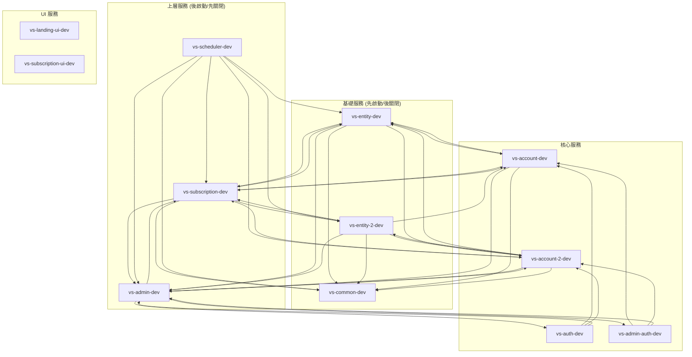

# AWS Lights Out 資源探索報告

**生成時間：** 2026-01-23
**AWS 帳號：** 677276105166
**探索區域：** us-east-1

---

## 摘要

| 指標                 | 數值           |
| -------------------- | -------------- |
| ECS Services         | 14             |
| RDS Instances        | 4              |
| 已有 Lights Out Tags | 0              |
| 建議納入管理         | 11 ECS + 1 RDS |

---

## ECS Services

| Region    | Cluster                            | Service                | 狀態 | Auto Scaling | 風險等級 | Lights Out 支援 |
| --------- | ---------------------------------- | ---------------------- | ---- | ------------ | -------- | --------------- |
| us-east-1 | vs-account-service-ecs-cluster-dev | vs-subscription-dev    | 1/1  | ✅ (1-2)     | low      | ✅ supported    |
| us-east-1 | vs-account-service-ecs-cluster-dev | vs-auth-dev            | 1/1  | ✅ (1-2)     | low      | ✅ supported    |
| us-east-1 | vs-account-service-ecs-cluster-dev | vs-admin-dev           | 1/1  | ✅ (1-2)     | low      | ✅ supported    |
| us-east-1 | vs-account-service-ecs-cluster-dev | vs-admin-auth-dev      | 1/1  | ✅ (1-2)     | low      | ✅ supported    |
| us-east-1 | vs-account-service-ecs-cluster-dev | vs-subscription-ui-dev | 1/1  | ❌           | low      | ✅ supported    |
| us-east-1 | vs-account-service-ecs-cluster-dev | manager-dev            | 0/0  | ❌           | low      | ⚠️ 已停止       |
| us-east-1 | vs-account-service-ecs-cluster-dev | vs-scheduler-dev       | 1/1  | ✅ (1-2)     | high     | ⚠️ caution      |
| us-east-1 | vs-account-service-ecs-cluster-dev | vs-landing-ui-dev      | 1/1  | ✅ (1-2)     | low      | ✅ supported    |
| us-east-1 | vs-account-service-ecs-cluster-dev | vs-common-dev          | 1/1  | ✅ (1-2)     | low      | ✅ supported    |
| us-east-1 | vs-account-service-ecs-cluster-dev | chargify-dev           | 0/0  | ❌           | low      | ⚠️ 已停止       |
| us-east-1 | vs-account-service-ecs-cluster-dev | vs-account-2-dev       | 1/1  | ✅ (1-2)     | low      | ✅ supported    |
| us-east-1 | vs-account-service-ecs-cluster-dev | vs-account-dev         | 1/1  | ✅ (1-2)     | low      | ✅ supported    |
| us-east-1 | vs-account-service-ecs-cluster-dev | vs-entity-dev          | 1/1  | ✅ (1-2)     | low      | ✅ supported    |
| us-east-1 | vs-account-service-ecs-cluster-dev | vs-entity-2-dev        | 1/1  | ✅ (1-2)     | low      | ✅ supported    |

### 高風險服務說明

**vs-scheduler-dev (high risk):**

- 服務名稱包含 "scheduler"，可能執行定時任務
- 如果在 lights-out 期間有排程任務，可能會遺失
- 建議：
  - 確認排程任務是否在非工作時間執行
  - 如果排程任務只在工作時間執行，可以納入 lights-out
  - 考慮使用較高的 priority（如 100）讓它最後關閉、最先啟動

---

## RDS Instances

| Region    | Instance ID                                             | 引擎              | 狀態      | 類型                | Lights Out 支援    |
| --------- | ------------------------------------------------------- | ----------------- | --------- | ------------------- | ------------------ |
| us-east-1 | vs-account-service-us-east-1-aurora-postgres-dev-reader | aurora-postgresql | available | Aurora Cluster 成員 | ❌ cluster-managed |
| us-east-1 | vs-account-service-us-east-1-aurora-postgres-dev-writer | aurora-postgresql | available | Aurora Cluster 成員 | ❌ cluster-managed |
| us-east-1 | vs-account-service-us-east-1-postgres-dev               | postgres          | available | 標準 RDS            | ✅ supported       |
| us-east-1 | vs-account-service-us-east-1-postgres-replica-dev-1     | postgres          | available | Read Replica        | ❌ not-supported   |

### 不支援的實例說明

**Aurora Cluster 成員 (2 instances):**

- vs-account-service-us-east-1-aurora-postgres-dev-reader
- vs-account-service-us-east-1-aurora-postgres-dev-writer
- 這些是 Aurora Serverless v2 cluster 的成員
- 目前 Lights Out Lambda **尚未實作** Aurora Cluster 啟停功能
- 如果需要管理，需要：
  1. 在 Lambda 中新增 `rds-cluster` handler
  2. 使用 `StartDBCluster` / `StopDBCluster` API

**Read Replica (1 instance):**

- vs-account-service-us-east-1-postgres-replica-dev-1
- Read Replica 無法獨立停止
- 停止 source DB 會影響 replica 的可用性

---

## 服務相依性分析

### 相依性圖



### 建議的啟停順序

根據相依性分析，建議的啟停順序如下：

**啟動順序 (由低 priority 到高 priority):**

1. `vs-common-dev` (priority: 10) - 基礎共用服務
2. `vs-entity-dev`, `vs-entity-2-dev` (priority: 20) - 實體服務
3. `vs-account-dev`, `vs-account-2-dev` (priority: 30) - 帳號服務
4. `vs-auth-dev`, `vs-admin-auth-dev` (priority: 40) - 認證服務
5. `vs-subscription-dev` (priority: 50) - 訂閱服務
6. `vs-admin-dev` (priority: 60) - 管理後台
7. `vs-landing-ui-dev`, `vs-subscription-ui-dev` (priority: 70) - UI 服務
8. `vs-scheduler-dev` (priority: 100) - 排程服務（最後啟動）

**停止順序**: (反向)

---

## Lights Out 支援程度對照

根據目前 Lights Out Lambda 的實作：

| 資源類型           | 支援程度    | 說明                                    |
| ------------------ | ----------- | --------------------------------------- |
| ECS Service        | ✅ 完全支援 | 支援 Auto Scaling 模式和 Direct 模式    |
| RDS DB Instance    | ✅ 完全支援 | Fire-and-forget 模式，支援 skipSnapshot |
| RDS Aurora Cluster | ❌ 不支援   | 需透過 cluster 啟停，目前未實作         |
| RDS Read Replica   | ❌ 不支援   | 無法獨立停止                            |

---

## 建議配置

### 建議納入 Lights Out 管理的資源

#### A. 優先推薦（低風險）

**ECS Services (11 個):**

- vs-common-dev (priority: 10)
- vs-entity-dev (priority: 20)
- vs-entity-2-dev (priority: 20)
- vs-account-dev (priority: 30)
- vs-account-2-dev (priority: 30)
- vs-auth-dev (priority: 40)
- vs-admin-auth-dev (priority: 40)
- vs-subscription-dev (priority: 50)
- vs-admin-dev (priority: 60)
- vs-landing-ui-dev (priority: 70)
- vs-subscription-ui-dev (priority: 70)

**建議 Tags：**

```yaml
lights-out:managed: 'true'
lights-out:env: 'dev'
lights-out:priority: '<依照上方建議的數值>'
```

**建議 SSM 配置（config/vs-account-dev.yml）：**

```yaml
resource_defaults:
  ecs-service:
    waitForStable: true
    stableTimeoutSeconds: 300
    start:
      minCapacity: 1
      maxCapacity: 2
      desiredCount: 1
    stop:
      minCapacity: 0
      maxCapacity: 0
      desiredCount: 0

  rds-db:
    waitAfterCommand: 60
    skipSnapshot: true # 開發環境建議跳過 snapshot 以節省成本

schedules:
  - name: weekday-schedule
    timezone: Asia/Taipei
    stop_cron: '0 22 * * 1-5' # 週一到週五 22:00 停止
    start_cron: '0 8 * * 1-5' # 週一到週五 08:00 啟動
    holidays:
      - '2026-01-01' # 元旦
      - '2026-01-27' # 農曆除夕
      - '2026-01-28' # 春節
      - '2026-01-29' # 春節
      - '2026-01-30' # 春節
      - '2026-02-28' # 和平紀念日
```

#### B. 需要注意（高風險）

**vs-scheduler-dev:**

- 建議先確認排程任務的執行時間
- 如果確認可以停止，使用較高 priority：

```yaml
lights-out:managed: 'true'
lights-out:env: 'dev'
lights-out:priority: '100' # 最後關閉，最先啟動
```

#### C. RDS 實例

**vs-account-service-us-east-1-postgres-dev (標準 RDS):**

```bash
aws rds add-tags-to-resource \
  --resource-name arn:aws:rds:us-east-1:677276105166:db:vs-account-service-us-east-1-postgres-dev \
  --tags Key=lights-out:managed,Value=true \
         Key=lights-out:env,Value=dev \
         Key=lights-out:priority,Value=100 \
  --region us-east-1
```

---

### 需要注意的資源

**目前已停止的 services:**

- manager-dev (desired: 0)
- chargify-dev (desired: 0)

這些 service 目前已經是停止狀態，可以：

- 選項 1：不納入 lights-out 管理（保持目前狀態）
- 選項 2：如果未來需要定期啟停，再加上 tags

---

### 不建議納入的資源

**Aurora Cluster 成員 (2 個):**

- vs-account-service-us-east-1-aurora-postgres-dev-reader
- vs-account-service-us-east-1-aurora-postgres-dev-writer

**原因：**

- 目前 Lights Out Lambda 不支援 Aurora Cluster 啟停
- 如果需要管理，需要新增 `rds-cluster` handler

**Read Replica (1 個):**

- vs-account-service-us-east-1-postgres-replica-dev-1

**原因：**

- Read Replica 無法獨立停止
- 如果主資料庫停止，replica 也會受影響

---

## 下一步

### 1. 為建議的資源加上 Tags

**ECS Services（批次加 tags 腳本）：**

```bash
#!/bin/bash

CLUSTER="vs-account-service-ecs-cluster-dev"
REGION="us-east-1"
ACCOUNT="677276105166"

# Priority 10 - 基礎服務
services_p10="vs-common-dev"
for service in $services_p10; do
  arn="arn:aws:ecs:$REGION:$ACCOUNT:service/$CLUSTER/$service"
  echo "Tagging $service (priority 10)..."
  aws ecs tag-resource \
    --resource-arn "$arn" \
    --tags key=lights-out:managed,value=true \
           key=lights-out:env,value=dev \
           key=lights-out:priority,value=10 \
    --region $REGION
done

# Priority 20 - Entity 服務
services_p20="vs-entity-dev vs-entity-2-dev"
for service in $services_p20; do
  arn="arn:aws:ecs:$REGION:$ACCOUNT:service/$CLUSTER/$service"
  echo "Tagging $service (priority 20)..."
  aws ecs tag-resource \
    --resource-arn "$arn" \
    --tags key=lights-out:managed,value=true \
           key=lights-out:env,value=dev \
           key=lights-out:priority,value=20 \
    --region $REGION
done

# Priority 30 - Account 服務
services_p30="vs-account-dev vs-account-2-dev"
for service in $services_p30; do
  arn="arn:aws:ecs:$REGION:$ACCOUNT:service/$CLUSTER/$service"
  echo "Tagging $service (priority 30)..."
  aws ecs tag-resource \
    --resource-arn "$arn" \
    --tags key=lights-out:managed,value=true \
           key=lights-out:env,value=dev \
           key=lights-out:priority,value=30 \
    --region $REGION
done

# Priority 40 - Auth 服務
services_p40="vs-auth-dev vs-admin-auth-dev"
for service in $services_p40; do
  arn="arn:aws:ecs:$REGION:$ACCOUNT:service/$CLUSTER/$service"
  echo "Tagging $service (priority 40)..."
  aws ecs tag-resource \
    --resource-arn "$arn" \
    --tags key=lights-out:managed,value=true \
           key=lights-out:env,value=dev \
           key=lights-out:priority,value=40 \
    --region $REGION
done

# Priority 50 - Subscription 服務
services_p50="vs-subscription-dev"
for service in $services_p50; do
  arn="arn:aws:ecs:$REGION:$ACCOUNT:service/$CLUSTER/$service"
  echo "Tagging $service (priority 50)..."
  aws ecs tag-resource \
    --resource-arn "$arn" \
    --tags key=lights-out:managed,value=true \
           key=lights-out:env,value=dev \
           key=lights-out:priority,value=50 \
    --region $REGION
done

# Priority 60 - Admin 服務
services_p60="vs-admin-dev"
for service in $services_p60; do
  arn="arn:aws:ecs:$REGION:$ACCOUNT:service/$CLUSTER/$service"
  echo "Tagging $service (priority 60)..."
  aws ecs tag-resource \
    --resource-arn "$arn" \
    --tags key=lights-out:managed,value=true \
           key=lights-out:env,value=dev \
           key=lights-out:priority,value=60 \
    --region $REGION
done

# Priority 70 - UI 服務
services_p70="vs-landing-ui-dev vs-subscription-ui-dev"
for service in $services_p70; do
  arn="arn:aws:ecs:$REGION:$ACCOUNT:service/$CLUSTER/$service"
  echo "Tagging $service (priority 70)..."
  aws ecs tag-resource \
    --resource-arn "$arn" \
    --tags key=lights-out:managed,value=true \
           key=lights-out:env,value=dev \
           key=lights-out:priority,value=70 \
    --region $REGION
done

# Priority 100 - Scheduler 服務（需要先確認後再執行）
# service="vs-scheduler-dev"
# arn="arn:aws:ecs:$REGION:$ACCOUNT:service/$CLUSTER/$service"
# aws ecs tag-resource \
#   --resource-arn "$arn" \
#   --tags key=lights-out:managed,value=true \
#          key=lights-out:env,value=dev \
#          key=lights-out:priority,value=100 \
#   --region $REGION

echo "Done!"
```

**RDS Instance：**

```bash
aws rds add-tags-to-resource \
  --resource-name arn:aws:rds:us-east-1:677276105166:db:vs-account-service-us-east-1-postgres-dev \
  --tags Key=lights-out:managed,Value=true \
         Key=lights-out:env,Value=dev \
         Key=lights-out:priority,Value=100 \
  --region us-east-1
```

### 2. 建立 SSM Parameter Store 配置

```bash
# 建立配置檔案
cp config/sss-lab.yml config/vs-account-dev.yml

# 編輯配置（參考上方建議配置）
# 然後使用 run-interactive.js 部署時會自動上傳
```

### 3. 部署 Lights Out Lambda

```bash
cd /Users/tsaiyu/GitHub/ViewSonic/worktrees/edu-aws-lights-out/feat/onboarding-ai-integration

# 使用互動式部署
pnpm deploy

# 選擇或輸入 stage name: vs-account-dev
# 選擇 region: us-east-1
```

### 4. 測試

```bash
# 檢查資源探索
aws lambda invoke \
  --function-name lights-out-vs-account-dev \
  --payload '{"action":"discover"}' \
  --region us-east-1 \
  /tmp/discover-output.json && cat /tmp/discover-output.json | jq '.'

# 檢查狀態
aws lambda invoke \
  --function-name lights-out-vs-account-dev \
  --payload '{"action":"status"}' \
  --region us-east-1 \
  /tmp/status-output.json && cat /tmp/status-output.json | jq '.'
```

---

## 預期成本節省

假設每日 lights-out 時間為 14 小時（22:00-08:00），工作日為週一至週五：

**ECS Services (12 個運行中):**

- Fargate vCPU 成本: ~$0.04048 per vCPU-hour
- 假設每個 service 平均 0.5 vCPU
- 每日節省: 12 services × 0.5 vCPU × 14 hours × $0.04048 = ~$3.40
- 每月節省: $3.40 × 22 working days = **~$75**

**RDS Instance (1 個 db.r7g.large):**

- db.r7g.large 成本: ~$0.26 per hour
- 每日節省: 14 hours × $0.26 = ~$3.64
- 每月節省: $3.64 × 22 working days = **~$80**

**總計每月節省: ~$155**

**注意：**

- 如果 Aurora Cluster 也能納入管理（Aurora Serverless v2），預期可再節省更多
- 實際節省會依據運算資源配置和使用時間有所不同

---

## 附錄：資源清單

### ECS Services 完整列表

| Service Name           | Desired | Running | Auto Scaling | Task Definition |
| ---------------------- | ------- | ------- | ------------ | --------------- |
| vs-subscription-dev    | 1       | 1       | 1-2          | :108            |
| vs-auth-dev            | 1       | 1       | 1-2          | -               |
| vs-admin-dev           | 1       | 1       | 1-2          | -               |
| vs-admin-auth-dev      | 1       | 1       | 1-2          | -               |
| vs-subscription-ui-dev | 1       | 1       | ❌           | -               |
| manager-dev            | 0       | 0       | ❌           | -               |
| vs-scheduler-dev       | 1       | 1       | 1-2          | -               |
| vs-landing-ui-dev      | 1       | 1       | 1-2          | -               |
| vs-common-dev          | 1       | 1       | 1-2          | -               |
| chargify-dev           | 0       | 0       | ❌           | -               |
| vs-account-2-dev       | 1       | 1       | 1-2          | -               |
| vs-account-dev         | 1       | 1       | 1-2          | -               |
| vs-entity-dev          | 1       | 1       | 1-2          | -               |
| vs-entity-2-dev        | 1       | 1       | 1-2          | -               |

### RDS Instances 完整列表

| Instance ID                                             | Engine            | Class         | Status    | Type                |
| ------------------------------------------------------- | ----------------- | ------------- | --------- | ------------------- |
| vs-account-service-us-east-1-aurora-postgres-dev-reader | aurora-postgresql | db.serverless | available | Aurora Cluster 成員 |
| vs-account-service-us-east-1-aurora-postgres-dev-writer | aurora-postgresql | db.serverless | available | Aurora Cluster 成員 |
| vs-account-service-us-east-1-postgres-dev               | postgres          | db.r7g.large  | available | 標準 RDS            |
| vs-account-service-us-east-1-postgres-replica-dev-1     | postgres          | db.t3.small   | available | Read Replica        |
