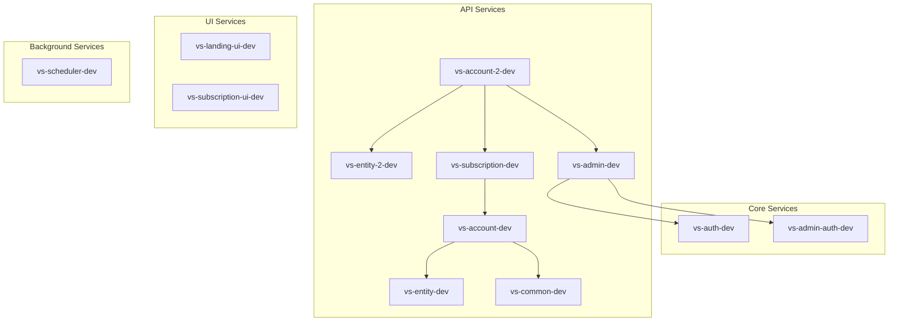

# AWS Lights Out 資源探索報告

**生成時間：** 2026-01-26
**AWS 帳號：** 677276105166
**探索區域：** us-east-1

---

## 摘要

| 指標                 | 數值          |
| -------------------- | ------------- |
| ECS Services         | 14            |
| RDS Instances        | 4             |
| 已有 Lights Out Tags | 0             |
| 建議納入管理         | 9 ECS + 1 RDS |

---

## ECS Services

| Region    | Cluster                            | Service                | 狀態 | Auto Scaling | 風險等級 | Lights Out 支援 |
| --------- | ---------------------------------- | ---------------------- | ---- | ------------ | -------- | --------------- |
| us-east-1 | vs-account-service-ecs-cluster-dev | vs-auth-dev            | 1/1  | ✅ (1-2)     | low      | ✅ supported    |
| us-east-1 | vs-account-service-ecs-cluster-dev | vs-admin-auth-dev      | 1/1  | ✅ (1-2)     | low      | ✅ supported    |
| us-east-1 | vs-account-service-ecs-cluster-dev | vs-subscription-ui-dev | 1/1  | ❌           | low      | ✅ supported    |
| us-east-1 | vs-account-service-ecs-cluster-dev | vs-landing-ui-dev      | 1/1  | ✅ (1-2)     | low      | ✅ supported    |
| us-east-1 | vs-account-service-ecs-cluster-dev | vs-common-dev          | 1/1  | ✅ (1-2)     | low      | ✅ supported    |
| us-east-1 | vs-account-service-ecs-cluster-dev | vs-account-dev         | 1/1  | ✅ (1-2)     | low      | ✅ supported    |
| us-east-1 | vs-account-service-ecs-cluster-dev | vs-entity-dev          | 1/1  | ✅ (1-2)     | low      | ✅ supported    |
| us-east-1 | vs-account-service-ecs-cluster-dev | vs-entity-2-dev        | 1/1  | ✅ (1-2)     | low      | ✅ supported    |
| us-east-1 | vs-account-service-ecs-cluster-dev | vs-scheduler-dev       | 1/1  | ✅ (1-2)     | high     | ⚠️ caution      |
| us-east-1 | vs-account-service-ecs-cluster-dev | vs-admin-dev           | 0/1  | ✅ (1-2)     | high     | ⚠️ caution      |
| us-east-1 | vs-account-service-ecs-cluster-dev | vs-subscription-dev    | 0/1  | ✅ (1-2)     | high     | ⚠️ caution      |
| us-east-1 | vs-account-service-ecs-cluster-dev | vs-account-2-dev       | 1/1  | ✅ (1-2)     | high     | ⚠️ caution      |
| us-east-1 | vs-account-service-ecs-cluster-dev | manager-dev            | 0/0  | ❌           | low      | ✅ supported    |
| us-east-1 | vs-account-service-ecs-cluster-dev | chargify-dev           | 0/0  | ❌           | low      | ✅ supported    |

### 高風險服務說明

**vs-scheduler-dev (high risk):**

- 包含 `vs-scheduler` 容器 (scheduler role)
- Scheduler 可能有長時間執行的排程任務
- 建議：
  - 確認排程任務的執行時間窗口
  - 設定較晚的關閉時間（確保任務完成）
  - 使用較高 priority 值讓它最後關閉、最先啟動

**vs-admin-dev (high risk):**

- 包含 `vs-admin-scheduler` 容器 (scheduler role)
- Scheduler 可能有長時間執行的排程任務
- 建議：
  - 確認 admin scheduler 的任務類型和執行頻率
  - 如果是郵件發送排程，需評估延遲發送的影響

**vs-subscription-dev (high risk):**

- 包含 `vs-subscription-webhook` 容器 (webhook role)
- 包含 `vs-subscription-scheduler` 容器 (scheduler role)
- Webhook 停止時可能遺失外部系統（如 Maxio/Chargify）的請求
- 建議：
  - 確認 webhook 來源是否有重試機制
  - 考慮在非工作時間是否會有 webhook 請求

**vs-account-2-dev (high risk):**

- 包含 `vs-account-2-webhook` 容器 (webhook role)
- 包含 `vs-account-2-scheduler` 容器 (scheduler role)
- Webhook 停止時可能遺失外部請求
- 建議：
  - 評估是否有關鍵的外部整合依賴此 webhook

---

## RDS Instances

| Region    | Instance ID                                             | 引擎              | 狀態      | 類型                | Lights Out 支援    |
| --------- | ------------------------------------------------------- | ----------------- | --------- | ------------------- | ------------------ |
| us-east-1 | vs-account-service-us-east-1-postgres-dev               | postgres 14.17    | available | 標準 RDS            | ✅ supported       |
| us-east-1 | vs-account-service-us-east-1-postgres-replica-dev-1     | postgres 14.17    | available | Read Replica        | ❌ not-supported   |
| us-east-1 | vs-account-service-us-east-1-aurora-postgres-dev-writer | aurora-postgresql | available | Aurora Cluster 成員 | ❌ cluster-managed |
| us-east-1 | vs-account-service-us-east-1-aurora-postgres-dev-reader | aurora-postgresql | available | Aurora Cluster 成員 | ❌ cluster-managed |

### 不支援的實例說明

**Aurora Cluster 成員 (2 instances):**

- `vs-account-service-us-east-1-aurora-postgres-dev-writer`
- `vs-account-service-us-east-1-aurora-postgres-dev-reader`
- 這些是 Aurora Serverless v2 cluster 的成員
- 目前 Lights Out Lambda **尚未實作** Aurora Cluster 啟停功能
- 如果需要管理，需要：
  1. 實作 `rds-cluster` handler 使用 `StartDBCluster` / `StopDBCluster` API
  2. 或考慮使用 Aurora Serverless v2 的自動暫停功能

**Read Replica (1 instance):**

- `vs-account-service-us-east-1-postgres-replica-dev-1`
- Read Replica 無法獨立停止
- 停止 source DB 會自動影響 replica

---

## 服務相依性分析

### 相依性圖



### 建議的服務群組

**群組 1: 認證服務**

- vs-auth-dev
- vs-admin-auth-dev

應一起啟停，因為是所有服務的認證基礎。

**群組 2: 核心 API 服務**

- vs-entity-dev
- vs-entity-2-dev
- vs-common-dev
- vs-account-dev
- vs-account-2-dev

應一起啟停，因為有密切的相依關係。

**群組 3: UI 服務**

- vs-landing-ui-dev
- vs-subscription-ui-dev

可獨立啟停，但依賴後端 API。

**群組 4: 高風險服務**

- vs-scheduler-dev
- vs-admin-dev
- vs-subscription-dev

需要特別注意啟停順序和時機。

### 建議的啟停順序

**啟動順序**:

1. RDS (vs-account-service-us-east-1-postgres-dev)
2. → vs-auth-dev, vs-admin-auth-dev
3. → vs-entity-dev, vs-entity-2-dev, vs-common-dev
4. → vs-account-dev, vs-account-2-dev
5. → vs-admin-dev, vs-subscription-dev
6. → vs-scheduler-dev
7. → vs-landing-ui-dev, vs-subscription-ui-dev

**停止順序**: (反向)

---

## Lights Out 支援程度對照

| 資源類型           | 支援程度    | 說明                                    |
| ------------------ | ----------- | --------------------------------------- |
| ECS Service        | ✅ 完全支援 | 支援 Auto Scaling 模式和 Direct 模式    |
| RDS DB Instance    | ✅ 完全支援 | Fire-and-forget 模式，支援 skipSnapshot |
| RDS Aurora Cluster | ❌ 不支援   | 需透過 cluster 啟停，目前未實作         |
| RDS Read Replica   | ❌ 不支援   | 無法獨立停止                            |

---

## 建議配置

### 建議納入 Lights Out 管理的資源

#### A. 優先推薦（低風險）

**ECS Services (8 個):**

- vs-auth-dev
- vs-admin-auth-dev
- vs-subscription-ui-dev
- vs-landing-ui-dev
- vs-common-dev
- vs-account-dev
- vs-entity-dev
- vs-entity-2-dev

**建議 Tags：**

```yaml
lights-out:managed: 'true'
lights-out:env: 'dev'
lights-out:priority: '50'
```

**建議 SSM 配置（config/us-east-1-dev.yml）：**

```yaml
resource_defaults:
  ecs-service:
    waitForStable: true
    stableTimeoutSeconds: 300
    start:
      minCapacity: 1
      maxCapacity: 2
      desiredCount: 1
    stop:
      minCapacity: 0
      maxCapacity: 0
      desiredCount: 0

  rds-db:
    waitAfterCommand: 60
    skipSnapshot: true # 開發環境建議跳過 snapshot 以節省成本

schedules:
  - name: weekday-schedule
    timezone: America/New_York # us-east-1 時區
    stop_cron: '0 22 * * 1-5' # 週一到週五 22:00 停止
    start_cron: '0 8 * * 1-5' # 週一到週五 08:00 啟動
    holidays:
      - '2026-01-01' # 元旦
      - '2026-07-04' # 美國國慶
```

#### B. 需要注意（中等風險）

**vs-scheduler-dev:**

- 建議先確認排程任務的執行時間窗口
- 如果確認可以停止，使用較高 priority：

```yaml
lights-out:managed: 'true'
lights-out:env: 'dev'
lights-out:priority: '100' # 較晚關閉，較早啟動
```

**vs-admin-dev:**

- 建議先確認 admin scheduler 任務類型
- 注意郵件發送排程的延遲影響

**vs-account-2-dev:**

- 確認 webhook 來源是否有重試機制
- 評估非工作時間的 webhook 請求量

**vs-subscription-dev:**

- 確認 Maxio/Chargify webhook 是否有重試機制
- 這是最敏感的服務，建議最後評估

#### C. RDS 實例

**vs-account-service-us-east-1-postgres-dev (標準 RDS):**

```bash
aws rds add-tags-to-resource \
  --resource-name arn:aws:rds:us-east-1:677276105166:db:vs-account-service-us-east-1-postgres-dev \
  --tags Key=lights-out:managed,Value=true \
         Key=lights-out:env,Value=dev \
         Key=lights-out:priority,Value=100 \
  --region us-east-1 \
  --profile sss-development-vs-account
```

---

### 需要注意的資源

**目前已停止的 services:**

- manager-dev (desired: 0)
- chargify-dev (desired: 0)

這些 service 目前已經是停止狀態，可以：

- 選項 1：不納入 lights-out 管理（保持目前狀態）
- 選項 2：如果未來需要定期啟停，再加上 tags

**目前 running 為 0 但 desired 為 1 的 services:**

- vs-subscription-dev (0/1)
- vs-admin-dev (0/1)

這些服務可能正在啟動中或有問題，建議先確認狀態。

---

### 不建議納入的資源

**Aurora Cluster (2 instances):**

- vs-account-service-us-east-1-aurora-postgres-dev-writer
- vs-account-service-us-east-1-aurora-postgres-dev-reader

**原因：**

- 目前 Lights Out Lambda 未實作 Aurora Cluster 支援
- Aurora Serverless v2 可考慮使用自動暫停功能作為替代

**如果需要管理：**

1. 需實作 `rds-cluster` handler
2. 使用 `StartDBCluster` / `StopDBCluster` API

---

## 下一步

### 1. 為建議的資源加上 Tags

**ECS Services（批次加 tags 腳本）：**

```bash
#!/bin/bash

export AWS_PROFILE=sss-development-vs-account
CLUSTER="vs-account-service-ecs-cluster-dev"
REGION="us-east-1"
ACCOUNT="677276105166"

# Low risk services (priority 50)
services_p50="vs-auth-dev vs-admin-auth-dev vs-subscription-ui-dev vs-landing-ui-dev vs-common-dev vs-account-dev vs-entity-dev vs-entity-2-dev"

for service in $services_p50; do
  arn="arn:aws:ecs:$REGION:$ACCOUNT:service/$CLUSTER/$service"
  echo "Tagging $service..."
  aws ecs tag-resource \
    --resource-arn "$arn" \
    --tags key=lights-out:managed,value=true \
           key=lights-out:env,value=dev \
           key=lights-out:priority,value=50 \
    --region $REGION
done

# High risk services (priority 100) - 需要先確認再執行
# services_p100="vs-scheduler-dev vs-admin-dev vs-account-2-dev vs-subscription-dev"
# for service in $services_p100; do
#   arn="arn:aws:ecs:$REGION:$ACCOUNT:service/$CLUSTER/$service"
#   echo "Tagging $service..."
#   aws ecs tag-resource \
#     --resource-arn "$arn" \
#     --tags key=lights-out:managed,value=true \
#            key=lights-out:env,value=dev \
#            key=lights-out:priority,value=100 \
#     --region $REGION
# done

echo "Done!"
```

**RDS Instance：**

```bash
export AWS_PROFILE=sss-development-vs-account

aws rds add-tags-to-resource \
  --resource-name arn:aws:rds:us-east-1:677276105166:db:vs-account-service-us-east-1-postgres-dev \
  --tags Key=lights-out:managed,Value=true \
         Key=lights-out:env,Value=dev \
         Key=lights-out:priority,Value=100 \
  --region us-east-1
```

### 2. 建立 SSM Parameter Store 配置

```bash
# 建立配置檔案
cp config/sss-lab.yml config/us-east-1-dev.yml

# 編輯配置（參考上方建議配置）
# 然後使用 run-interactive.js 部署時會自動上傳
```

### 3. 部署 Lights Out Lambda

```bash
cd /Users/tsaiyu/GitHub/ViewSonic/worktrees/edu-aws-lights-out/feat/onboarding-ai-integration

# 使用互動式部署
pnpm deploy

# 選擇或輸入 stage name: us-east-1-dev
# 選擇 region: us-east-1
```

### 4. 測試

```bash
# 檢查資源探索
aws lambda invoke \
  --function-name lights-out-us-east-1-dev \
  --payload '{"action":"discover"}' \
  --region us-east-1 \
  --profile sss-development-vs-account \
  /tmp/discover-output.json && cat /tmp/discover-output.json | jq '.'

# 檢查狀態
aws lambda invoke \
  --function-name lights-out-us-east-1-dev \
  --payload '{"action":"status"}' \
  --region us-east-1 \
  --profile sss-development-vs-account \
  /tmp/status-output.json && cat /tmp/status-output.json | jq '.'
```

---

## 預期成本節省

假設每日 lights-out 時間為 12 小時（22:00-08:00 + 週末），工作日為週一至週五：

**ECS Services (8 個低風險):**

- Fargate vCPU 成本: ~$0.04048 per vCPU-hour
- 假設每個 service 平均 0.5 vCPU
- 每日節省: 8 services × 0.5 vCPU × 12 hours × $0.04 = ~$1.94
- 每月節省: $1.94 × 22 working days = **~$42.68**

**RDS Instance (1 個 db.r7g.large):**

- db.r7g.large 成本: ~$0.192 per hour
- 每日節省: 12 hours × $0.192 = $2.30
- 每月節省: $2.30 × 22 working days = **~$50.60**

**總計每月節省: ~$93.28**

**注意：**

- 如果高風險服務也能納入管理，預期可再節省約 50%
- 如果 Aurora Cluster 也能納入管理，預期可再節省更多
- 週末全天停止可額外節省成本

---

## 附錄：資源清單

### ECS Services 完整列表

| Service Name           | Desired | Running | Auto Scaling | Task Definition |
| ---------------------- | ------- | ------- | ------------ | --------------- |
| vs-subscription-dev    | 1       | 0       | 1-2          | :109            |
| vs-auth-dev            | 1       | 1       | 1-2          | :80             |
| vs-admin-dev           | 1       | 0       | 1-2          | :85             |
| vs-admin-auth-dev      | 1       | 1       | 1-2          | :35             |
| vs-subscription-ui-dev | 1       | 1       | ❌           | :34             |
| manager-dev            | 0       | 0       | ❌           | :14             |
| vs-scheduler-dev       | 1       | 1       | 1-2          | :7              |
| vs-landing-ui-dev      | 1       | 1       | 1-2          | :21             |
| vs-common-dev          | 1       | 1       | 1-2          | :69             |
| chargify-dev           | 0       | 0       | ❌           | :8              |
| vs-account-2-dev       | 1       | 1       | 1-2          | :108            |
| vs-account-dev         | 1       | 1       | 1-2          | :81             |
| vs-entity-dev          | 1       | 1       | 1-2          | :83             |
| vs-entity-2-dev        | 1       | 1       | 1-2          | :108            |

### RDS Instances 完整列表

| Instance ID                                             | Engine            | Class         | Status    | Type                |
| ------------------------------------------------------- | ----------------- | ------------- | --------- | ------------------- |
| vs-account-service-us-east-1-postgres-dev               | postgres 14.17    | db.r7g.large  | available | 標準 RDS            |
| vs-account-service-us-east-1-postgres-replica-dev-1     | postgres 14.17    | db.t3.small   | available | Read Replica        |
| vs-account-service-us-east-1-aurora-postgres-dev-writer | aurora-postgresql | db.serverless | available | Aurora Cluster 成員 |
| vs-account-service-us-east-1-aurora-postgres-dev-reader | aurora-postgresql | db.serverless | available | Aurora Cluster 成員 |
